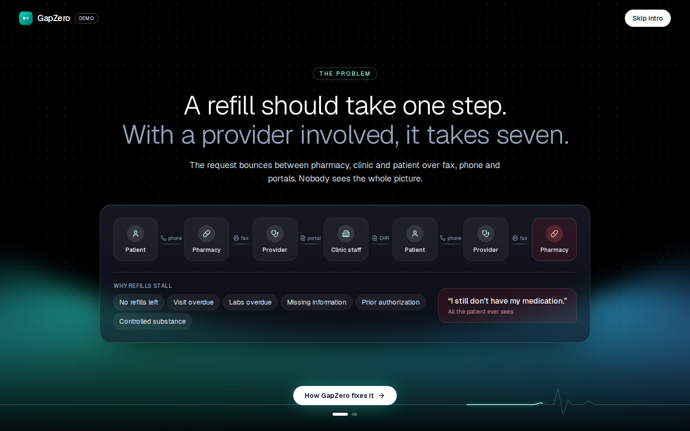
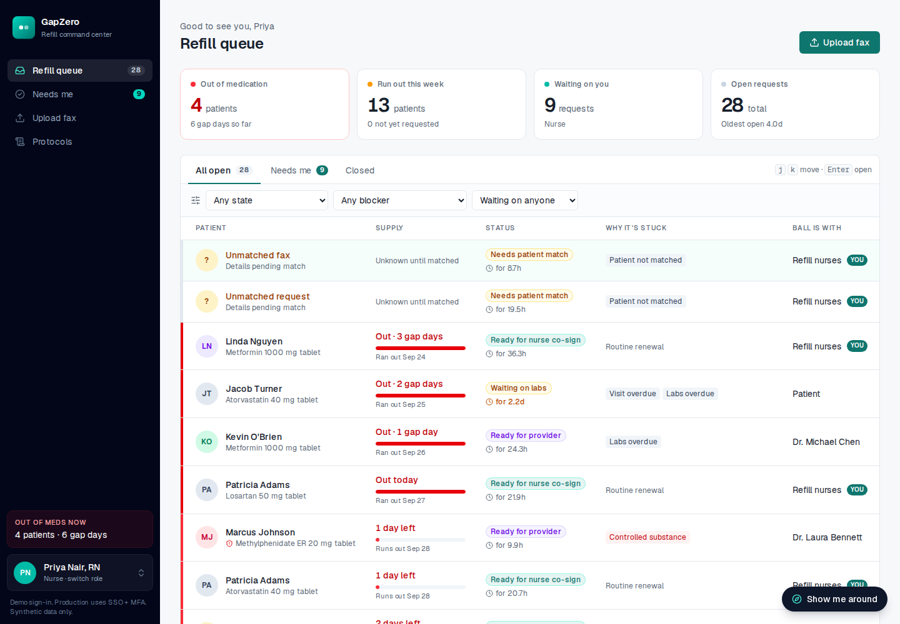
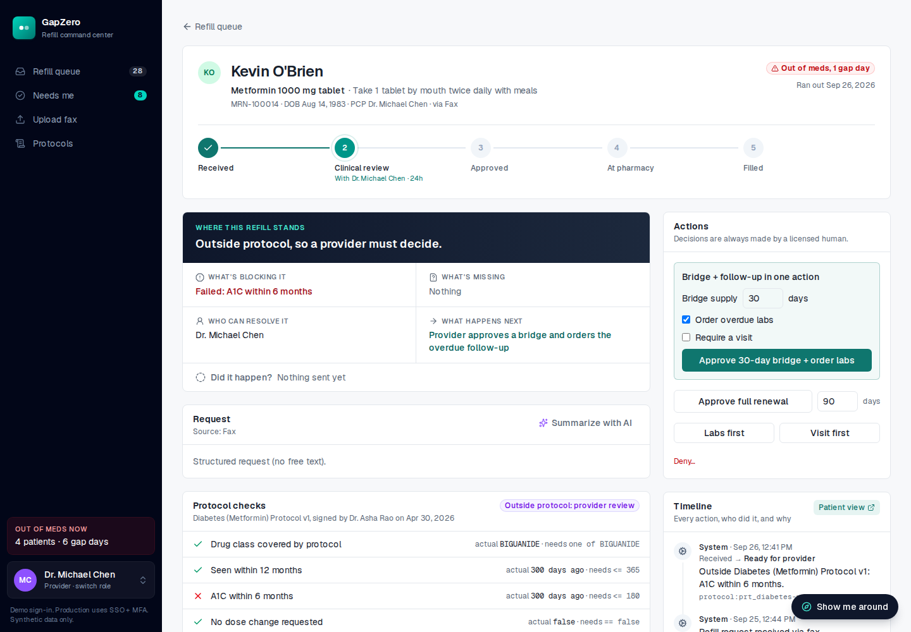
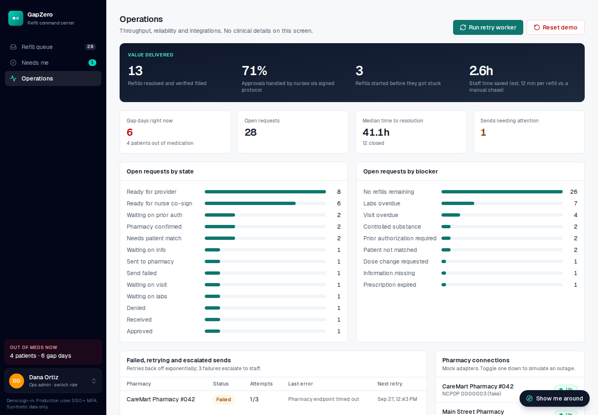
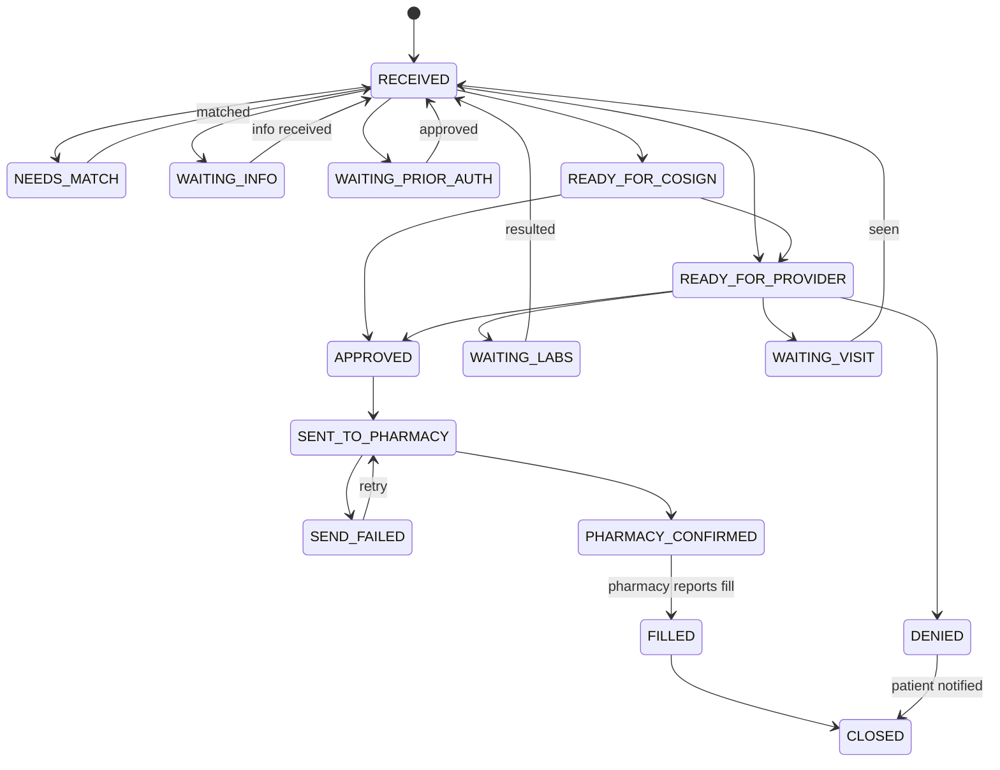

# GapZero

**Patients never run out of medication because of paperwork.**

A refill command center for physician groups. When a refill needs a provider, GapZero works out why it's stuck, gathers the context, routes it by the practice's own doctor-signed protocols, and verifies every step until the patient has the medication. Licensed humans make every clinical decision.

**[Live demo](https://gapzero-rose.vercel.app)** · **[Go-to-market plan](docs/GO_TO_MARKET.md)** · synthetic data only



---

## The problem

A patient needs a refill of a medication they already take, but the refill needs a provider: no refills left, a visit or labs overdue, missing information, prior authorization. The request then bounces between pharmacy, clinic staff, provider and patient over fax, phone and portals. Nobody sees the whole picture, and the patient only knows *"I still don't have my medication."*

The real bottleneck isn't the approval click. It's gathering the context to make it, and making sure what was decided actually happens.

## Who it's for

Primary and chronic-care physician groups of 10–100 providers. Refill nurses, medical assistants and providers use it every day; the practice administrator buys it. The patient gets a simple status link.

## What it does

| | |
| --- | --- |
| **1. Takes in every request** | e-Rx renewals, portal messages, phone notes, and faxes as PDFs, scans or phone photos |
| **2. Finds why it's stuck** | Deterministic blocker codes: no refills, prescription expired, visit or labs overdue, missing info, prior auth, controlled substance, dose change, unmatched patient |
| **3. Routes by signed protocol** | In-protocol renewals go to a nurse for one-click co-sign; everything else goes to a provider |
| **4. One-screen decision** | Blockers, protocol checks with actual values, labs, visits, AI summary, and the right actions for your role, e.g. *approve a 30-day bridge and order the overdue labs* in one click |
| **5. Verifies until filled** | Sends the e-Rx, retries with backoff if the pharmacy is down, escalates after 3 failures, and is only done when the pharmacy confirms the fill |
| **6. Prevents gaps** | Flags refills that will get stuck ~10 days before the patient runs out; one click starts them early |
| **7. Keeps the patient informed** | A private status link: first name, status and next step, never medication or clinical details |



## How the intelligence works

A refill is treated as a changing system state, not a series of screens. Every request answers: *what's happening now, what's missing, what's blocking it, who can resolve it, what happens next, and did it actually happen?*



**AI where it helps, rules where it must be predictable, humans where it matters.**

| AI (advisory, labelled) | Deterministic code | Licensed humans only |
| --- | --- | --- |
| Read faxes, scans and handwriting into fields with confidence scores | Blocker detection and protocol evaluation | Approve, deny, bridge, order labs or visits |
| Draft protocol rules from a doctor's plain English | Routing and every state transition | Sign protocols |
| Two-line case summary of why it's stuck | Controlled-substance guardrail | Confirm anything the system isn't sure of |
| | Days-left and gap-day math, retries, escalation | |

**We don't trust the model's own confidence; we verify it.**

1. **On-device OCR first** for scans and images (private, free). If it struggles (photos, handwriting), the user can choose **AI vision**, which reads the image directly.
2. **Every AI field is cross-checked** against a rule-based parser. Confidence only ever goes down: when they disagree, when the text shows OCR noise, or when a name is only an initial.
3. **Fields are verified against the patient's chart.** Medication, strength, directions and prescriber that match the chart exactly are cleared automatically.
4. **Patient identity is never cleared by the chart alone.** If the name or date of birth was hard to read, a person confirms it. A wrong-patient match is the costliest error.
5. **If the AI is down**, every feature falls back to deterministic demo mode, so nothing breaks.

## Guardrails

- The system never approves, denies or sends a prescription on its own.
- **Controlled substances always go to a provider**, enforced in server code, not protocol data. A nurse who tries anyway is refused by the server, and the attempt is logged.
- Protocols are inactive until a provider signs them. Signed versions are immutable; edits create a new version, with a diff.
- Protocol eligibility is re-checked at decision time, not trusted from triage.

## Security and data access

- **Role checks on the server** in every action and route (provider, nurse, front desk, ops). Front desk and ops never see clinical details.
- **Row Level Security** in Postgres, so Supabase's public API can't read any table.
- **Append-only event log** for every state change and every user, system and AI action.
- **Unguessable patient links** (144-bit tokens) showing first name and status only.
- Scans are OCR'd **in the browser**; AI vision is user-triggered and the image isn't stored.
- **Synthetic data only.** Production would use SSO + MFA and a HIPAA-eligible AI provider under a BAA.

## Reliability and observability

- **One state machine** is the only code allowed to change a refill's state. It validates the transition and writes the event in the same database transaction, with a guard against concurrent edits.
- **Pharmacy outages** (toggle one down on the Ops screen): the send fails, retries with exponential backoff, escalates to staff after 3 failures, and recovers when the pharmacy is back.
- **Every refill shows** its state, what it's waiting on, who owns the next step, how long it's been stuck, and when the patient runs out.
- **Ops screen:** gap days, median time to resolution, failed and escalated sends, and value delivered (refills resolved, nurse-protocol share, proactive saves, estimated staff time saved).





## Go-to-market

Beachhead: independent primary and chronic-care groups of 10–100 providers. A free 30-day pilot opens with a day-one scan of patients about to run out, then converts at **$129 per provider per month** (about 3.3x back on staff time, on stated assumptions). Expansion comes from providers, sites and networks (MSOs, IPAs, ACOs). North-star metric: **gap days**, the days patients go without medication.

Full plan, including customer map, positioning, the 8-stage funnel, pricing and ROI, onboarding, growth loops, metrics and risks: **[docs/GO_TO_MARKET.md](docs/GO_TO_MARKET.md)**.

## Try it

1. Open the **[live demo](https://gapzero-rose.vercel.app)**, read the two intro pages, and pick a role. Each screen has a **Show me around** walkthrough.
2. **As the refill nurse (Priya Nair):** see the prevention banner, then **Upload fax** and try the samples (handwritten phone photo, messy scan, clean PDF, scanned PDF with missing info).
3. **As the provider (Dr. Asha Rao):** approve a 30-day bridge + labs, simulate the pharmacy fill, and open the patient view.
4. **As the nurse on Marcus Johnson (controlled substance):** click "try co-signing anyway" and watch the server refuse.
5. **As ops (Dana Ortiz):** toggle CareMart down, approve Grace Thompson as the provider, run the retry worker, bring CareMart back up. **Reset demo** restores everything.

### Test documents

Ready-made synthetic uploads are in [docs/test-documents](docs/test-documents) (Rosa Delgado, PDF and PNG). To make your own, use one of these demo patients and write fields as `Label: value`:

| Patient | DOB | Medication | Directions | Qty / days | Prescriber | Expected result |
| --- | --- | --- | --- | --- | --- | --- |
| George Miller | 02/14/1948 | Amlodipine 5 mg tablet | Take 1 tablet by mouth once daily | 30 / 30 | Dr. Asha Rao | Nurse co-sign: every protocol check passes |
| Rosa Delgado | 04/12/1961 | Metformin 1000 mg tablet | Take 1 tablet by mouth twice daily with meals | 60 / 30 | Dr. Asha Rao | Provider: A1C overdue |
| Aisha Patel | 11/21/1972 | Levothyroxine 75 mcg tablet | Take 1 tablet by mouth every morning on an empty stomach | 30 / 30 | Dr. Laura Bennett | Provider: visit and TSH overdue |

Reset the demo before uploading the same patient twice (duplicate detection is not built yet).

## Tech stack

Next.js 16 (App Router) · TypeScript · Tailwind CSS · Prisma · Postgres on Supabase · Vercel · Groq (`openai/gpt-oss-120b` for text, `qwen/qwen3.8-27b` for vision) or Claude when `ANTHROPIC_API_KEY` is set · tesseract.js and pdf.js for in-browser OCR · driver.js for walkthroughs · Vitest and Playwright.

## Run locally

```bash
cp .env.example .env        # add DATABASE_URL and DIRECT_URL from Supabase (Connect → ORM → Prisma)
npm install
npx prisma migrate deploy
npm run db:seed
npm run dev                 # http://localhost:3000
```

AI is optional: add `GROQ_API_KEY` (free at console.groq.com) or `ANTHROPIC_API_KEY`. With neither, AI features run in deterministic demo mode.

| Command | What it does |
| --- | --- |
| `npm test` | 95 unit tests: rules engine, state machine, triage, permissions, guardrails, AI verification, patient-page privacy, demo data |
| `npm run smoke` | Runs the whole demo script end to end against the database (29 checks), then resets it |
| `npm run ai-check` | Calls the configured AI provider on the sample faxes, with no database writes |
| `npm run db:reset-demo` | Restores fresh synthetic demo data |

## Project structure

| Path | What |
| --- | --- |
| `lib/refill/stateMachine.ts` | The only code that changes a refill's state; validates, updates and logs in one transaction |
| `lib/refill/triage.ts`, `blockers.ts` | Deterministic blocker detection and routing, including the controlled-substance guardrail |
| `lib/refill/workflow.ts` | Decisions, pharmacy delivery with retries and escalation, fill verification, notifications |
| `lib/refill/explain.ts` | "Where this refill stands": the system state in plain language |
| `lib/rules/` | Pure protocol engine, fact computation, rule validation, version diffs |
| `lib/ai/` | Provider adapter, extraction, rule drafting, summaries, vision, and the verification layers (`calibrate.ts`, `chartVerify.ts`) |
| `lib/auth/permissions.ts` | Role matrix and who may decide what |
| `lib/adapters/` | Mocked EHR, pharmacy and SMS integrations |
| `app/` | Pages (queue, refill packet, upload, protocols, ops, patient tracking) and server actions |

## What's real and what's mocked

Real: the database, state machine, rules engine, role checks, AI extraction and vision, OCR, retries and escalation, audit log. Mocked behind adapters: the EHR (production: FHIR R4), the e-prescribing network and pharmacies (production: NCPDP SCRIPT), SMS, and sign-in (production: SSO + MFA). All patient data is synthetic.
